---

# C++

---

# Motywacja

Po co mam się uczyć C++?

----

# Żeby wbić OI-a i OIJ-a (!!!)

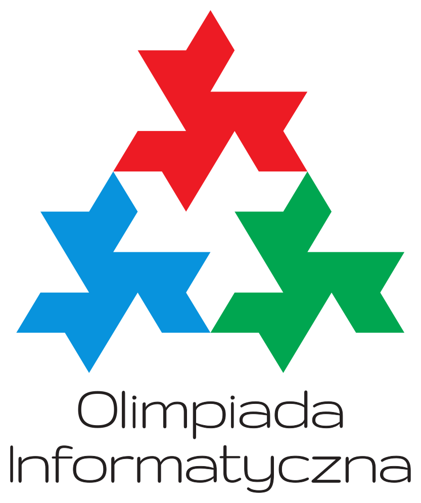

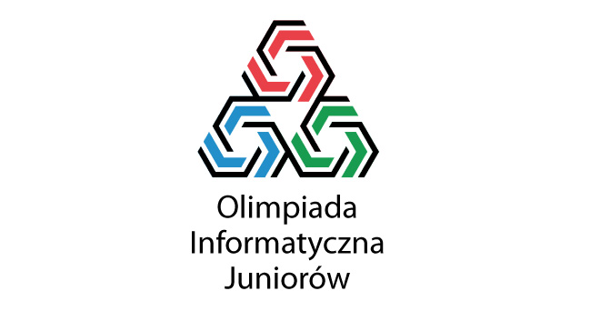

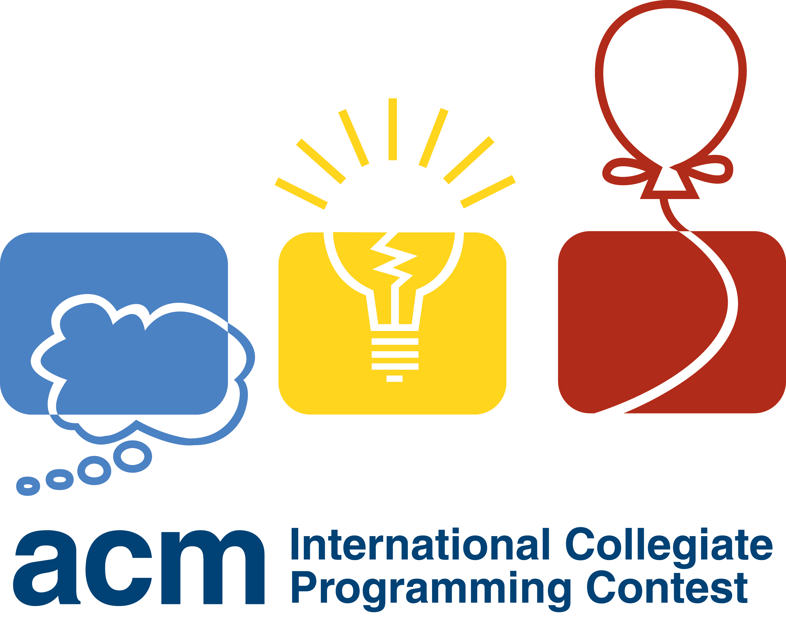

----

# Żeby się popisywać !!!

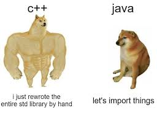

----

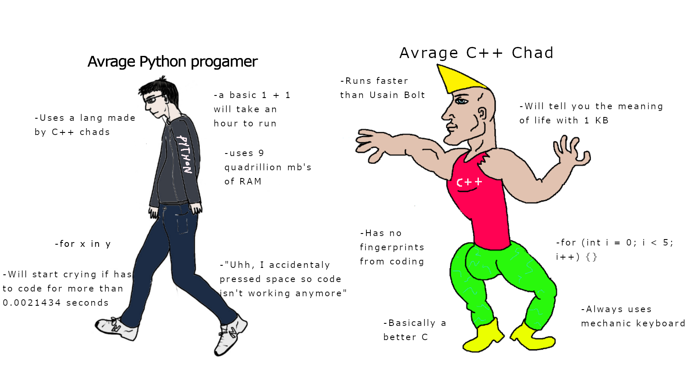

----


----

# Ale jest w tym coś więcej... 

## C++ jest:

- stary (40 lat), ale jary 
- nadal rozwijany (C\++26)
- źródłem rzeczy, które filozom się nie śniły

---

# Trzy części i trzy obietnice

----

# Pierwsza obietnica


Zrozumiesz ten kod

```cpp=
struct MyList {
    int     head;
    MyList* tail;
};
```


----

# Druga obietnica

Zrozumiesz ten kod

```cpp=
#include<algorithm>

int max = 0;

int& foo(int& _1, int& _2) {
    std::cout << _1 << ":" << _2 << "\n";
    
    return _1 < _2 ? _1 : _2;
}
```


----

# Ostatnia obietnica

Nie zrozumiesz tego kodu

```cpp=
template<typename U>
class MyVector {
    vector <U> content;

public:
    template<typename Func>
    void map(Func f) {
        for (auto& el : content) {
            el = f(el);
        }
    }
};
```

----

Ale Cię nie przestraszy ;)

---


# Część pierwsza - dlaczego C

Note: 
Zanim był C, był C++

----

# Poznajcie swoich przodków


Note:
Ken Thompson - Twórca Języka B, Go, współtwórca Unixa
Dennis Ritchie - Twórca C

Język A - Nie było :(
Język B - 1969
Język C - 1972

----

# Zastosowania C

- kompilatory i interpretery
- systemy operacyjne
- *embedded systems*
- silniki do baz danych

---

# Makra

---

# Czym jest `#include`

```c=
#include <stdio.h>

int main(){
    printf("Hello world!\n");
}
```

----

# To tylko wklejenie zawartości pliku...

```c=
// even.hpp
if (x % 2 == 0)
```

```c=
// main.c
int x = 5;

#include "even.hpp"
{
    printf("has a pair!");
}
else 
{
    printf("one is left out!");
}
```

----

# Równoważne

```c=
// main.c expanded
int x = 5;

if (x == 2)
{
    printf("has a pair!");
}
else 
{
    printf("one is left out!");
}
```


---

# Czym jest `#define`

```c=
#define ll long long
```

---

# To tylko podstawienie symboli

```c=
#define ll long long

int main() {
    ll x = 5;
    printf("%d", x);
}
```

----

# Równoważnie

```c=
int main() {
    long long x;
    printf("%d", x);
}
```

---

# Czym jest `#define func(a)`

----

# To podstawienie symboli z parametrami

```c=
#define square(x) x * x

int main() {
    int y = 4
    int x = square(y); 
    printf("%d", x); // ?
}
```

----

# Równoważne

```c=
#define square(x) x * x

int main() {
    int y = 4
    int x = y * y; 
    printf("%d", x); // ?
}
```

----

# Trochę inaczej

```c=
#define square(x) x * x

int main() {
    int x = square(4);
    printf("%d", x); // ?
}
```

----

# Równoważne

```c=
#define square(x) x * x

int main() {
    int x = 4 * 4;
    printf("%d", x); // ?
}
```


----

# A co teraz?


```c=
#define square(x) x * x

int main() {
    int x = square(2 + 2); // ?
}
```

----

# Wyjaśnienie


```c=
#define square(x) x * x

int main() {
    int x = 2 + 2 * 2 + 2; // ?
}
```

**Makra to nie są funkcje!!**

---

# Wnioski z makr

- operują na plikach i tekście
- używane są głównie do nudnego kodu (boilerplate)
- można kochać, można nienawidzieć, warto znać

----

# Rozwijanie makr

```bash
g++ kod.cpp -E
```

lub

```bash
clang++ kod.cpp -E
```


----

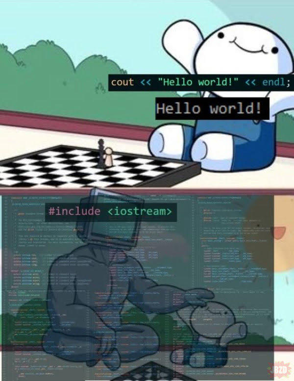

---

# Wskaźniki 

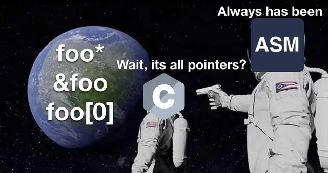

---

## Zagadka (?)

```c=
#include <stdio.h>

void inc(int x) {
    x++;
}

int main(void) {
    int number = 5;
    inc(number);

    printf("%d\n", number); // ?
}
```

---

# Pamięć w komputerze

- składa się z bajtów
- jest duża (2⁶⁴ =1,845×10¹⁹ )
- myślimy o niej jak o tablicy

<br><br><br>

**Tablica ma zawsze indeksy!!**

----

# Wskaźnik to adres w pamięci!

- 64-bitowa liczba
- wskazuje konkretne miejsce w naszej "tablicy"
- "tutaj coś jest"

---

# Operacje na wskaźnikach

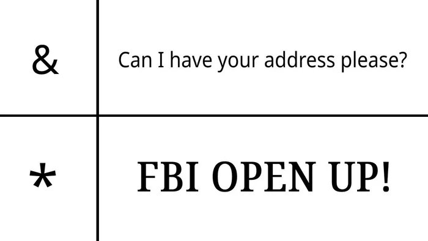

----

# "Czy Pani Agnieszka tutaj mieszka?"

```c=
int x = 12;
int* ptr = &x;

printf("%d", ptr); // ?
```

----

# "Pokaż mi swoje towary"

```c=
int x = 12;
int* ptr = &x;

printf("%d", *ptr); // ?
```

----

# Zagadka

```c=
int main() {
    int x = 5;
    int* p = &x;

    *p = 100;

    printf("%d", x); // ?
}
```

----

# Druga runda

```c=
#include <stdio.h>

void inc(int* x) {
    (*x)++;
}

int main(void) {
    int number = 5;
    inc(&number);

    printf("%d\n", number); // ?
}
```

---

# Wskaźniki są wśród nas

----

# Zagadka - gdzie jest wskaźnik

```c=
int n;
int tab[n];
...

for (int i = 0; i < n; i++) {
    tab[i] += 1;
}
```

---

# Co to jest **tablica**?

Tablica to wycinek naszej pamięci.

----

Taki kod

```
int tab[n];
```

Sprowadza się do tego

@TODO: dać img wskazujący na tablicę

----

# Ostatni będą pierwszymi

`tab + n` to **wskaźnik na pierwszy bajt poza tablicą**.

W C++ się tego używa.

----

# Przykład

```
sort(tab, tab + n);
```

Podajemy funkcji przedział [tab, tab + n).

---

# Hahaha, intuicja nie działa

Tak naprawdę `tab[i]` to `*(tab + i)`.

```c=
int n;
int tab[n];
...

for (int i = 0; i < n; i++) {
    i[tab] += 1;                //!!! 
}
```

----

I w ten sposób popełnia się zbrodnie wojenne...

---

# Wskaźnik jako *iterator*

**Ale co to jest iterator?**

----

# Iterator 

- idzie w lewo
- idzie w prawo
- można go zapytać o wartość

@TODO: taśma z maszyny turinga (animacja ?)

----

# Czekaj, ale wskaźnik to umie!

```c=
int tab[3] = {31, 2, 7}
int* iter = tab + 1;

iter--;
int x = *iter; // ?

iter++;
int y = *iter; // ?
```

---

# Jak to jest wynaleźć pętle `for`, dobrze?


```c=
int tab[n];
...

int* end = tab + n;
for (int* i = tab; i != end; i++) {
    *i -= 5;
}

```

----

# Zagadka

```c=
int tab[3] = {12, 7, 3};

int* iter = tab; // &(tab[0])

iter++;
printf("%d", *iter); // ?

printf("%d", *(iter++)); // ????

```

----

# Wyjaśnienie inkrementacji

Mamy dwa sposoby na inkrementację wartości `v`:
- `v++` - zwróć aktualną wartość, zwiększ
- `++v` - zwiększ, zwróć aktualną wartość

**Działa nie tylko na wskaźnikach**

----

# Zagadka

```c=
int x = 6;

int y = (++x); // ?
int z = (x++); // ?
int w = x;     // ?
```

---

# Czym się różnią te dwa wskaźniki?

`int*` oraz `long long*`

----

# Typ wskaźnika

Określa *jaki jest obiekt typu na który wskazujemy*.

**Niezealżenie od typu, wskaźnik zawsze ma taki sam rozmiar.**

----

# Zagadka

```c=
#include <stdio.h>
#include <stdint.h>

int main(void)
{
    uint8_t x = 255;
    int8_t  *ps8 = (int8_t *)&x;

    printf("%d\n", *ps8);

    return 0;
}
```

*Psst...* Wyszukaj " Quake Fast inverse square root" po więcej

----

# Życie na krawędzi

- `void*` - surowy wskaźnik bez typu 
- `NULL` - pamięć która nie powinna być nigdy dostępna

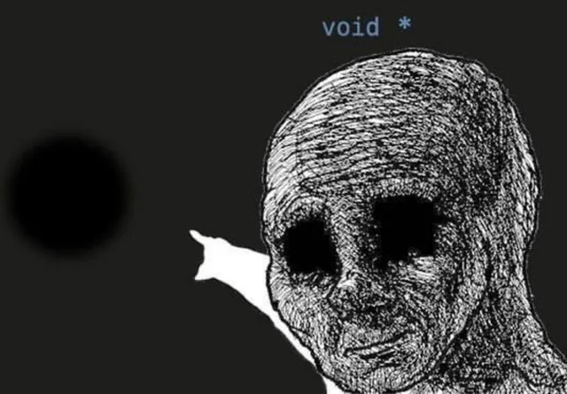


----

# Przykład I

```c=
#include <stdio.h>
#include <stdint.h>

void print_value(void *ptr) {
    uint32_t *p = (uint32_t *)ptr;
    printf("%u\n", *p);
}

int main(void) {
    uint16_t x = 100;
    print_value(&x);
}
```

----

# Przykład II

```c=
#include <stdio.h>

int main(void) {
    int* ptr = NULL;
    printf("%d\n", *ptr);
}
```

----

# Kontrowersje

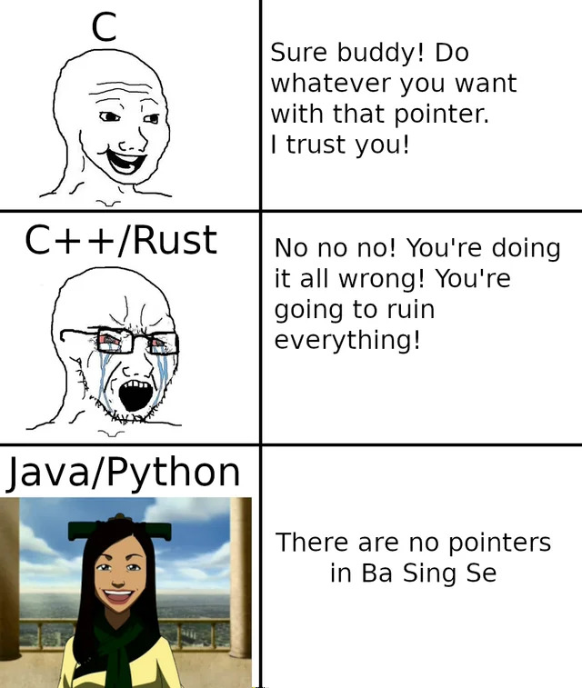

---

# "A czy wskaźnik ze wskaźnikiem może?"

```c=
int x = 12;
int* ptr = &x;
int** ptr_ptr = &ptr;

printf("%d", *ptr_ptr); // ?
printf("%d", **ptr_ptr); // ?
```

----

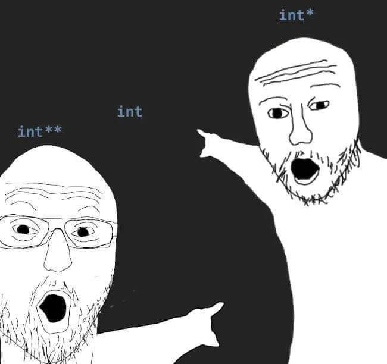

----

# KISS (Keep It Simple & Stupid)

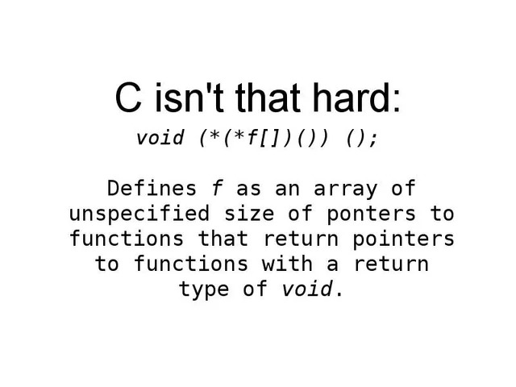

---

# `struct`

----

# Brzmi znajomo?

```cpp=
#include <iostream>

using namspace std;

int main() {
    pair<string, pair<int, int>> el;
    cin >> el.first >> el.second.first >> el.second.second;
}

```

----

# C - We mnie przyjaciela masz

```cpp=

struct name {
    type_1 field_1;
    type_2 field_2;
    type_3 field_3;
    ...
};

```

----

# Nasz kod z wcześniej

```cpp=
#include <iostream>
using namspace std;

struct Osoba {
    string imie;
    int    wiek;
    int    waga;
};

int main() {
    Osoba p;
    cin >> p.imie >> p.wiek >> p.waga;
}
```

Czyż nie lepiej?

----

# Ciekawostka

Żeby sprawdzić rozmiar typu używamy makra `sizeof`

```c=
#include <stdint.h>

struct MyStruct {
    int64_t num_1; // 8 bajtów
    int16_t num_2; // 2 bajtów
    int32_t num_3; // 4 bajtów
};

int expr = sizeof(MyStruct); // ?
```

Podpowiedź: **allignment**

---

# Operator `->`


Zamiast

```c=
void foo(claz* obj) {
    (*obj).field = 68;
    ...
}
```

Można

```c=
void foo(claz* obj) {
    obj->field = 68;
    ...
}
```

---

# Linked lista


---

# Część jeden i pół

---

# `const`

----

# Brzmi znajomo?

```c=
int arr_1[1000007];
int arr2[10000007];
long long array[1000007];

int main() { ... }
```

----

# A gdyby tak...

```c=

int TASK_N = 1000007;

int arr_1[TASK_N];
int arr2[TASK_N];
long long array[TASK_N];

int main() { ... }
```


----

# Znaczenie `const`

**Kompilator!**
**Ta wartość ma się nie zmieniać!**
**Pilnuj tego!**

----

# Nasz ostateczny kod

```c=

const int TASK_N = 1'000'007; // 1e6 + 7

int arr_1[TASK_N];
int arr2[TASK_N];
long long array[TASK_N];

int main() { ... }
```

----

# Ciekawostka

```c=
int* ptr_1;
int* const ptr_2;
int const* ptr_3;
int const* const ptr_4;
```

---

# `enum`

----

# Brzmi znajomo?

```cpp=
int army = 1;

void foo(int action) {
    if (action == 0) {
        army *= 2;
    }
    if (action == 1) {
        army += 1;
    }
    if (action == 2) {
        army -= 5;
    }
}

```

----

# C - We mnie przyjaciela masz

```cpp=

enum name {
    option_1,
    option_2,
    option_3,
    ...
};
```

----

# Nasz kod z wcześniej

```cpp=
int army = 1;
enum Action { MULTIPLY, INCREASE, DECREASE };

void foo(Action action) {
    if (action == MULTIPLY) {
        army *= 2;
    }
    if (action == INCREASE) {
        army += 1;
    }
    if (action == DECREASE) {
        army -= 5;
    }
}
```

---

# Cześć dwa i trzy czwarte - disclaimer

---

# Część trzecia - móóóóój jest ten kawałek podłogiiiiiii....
